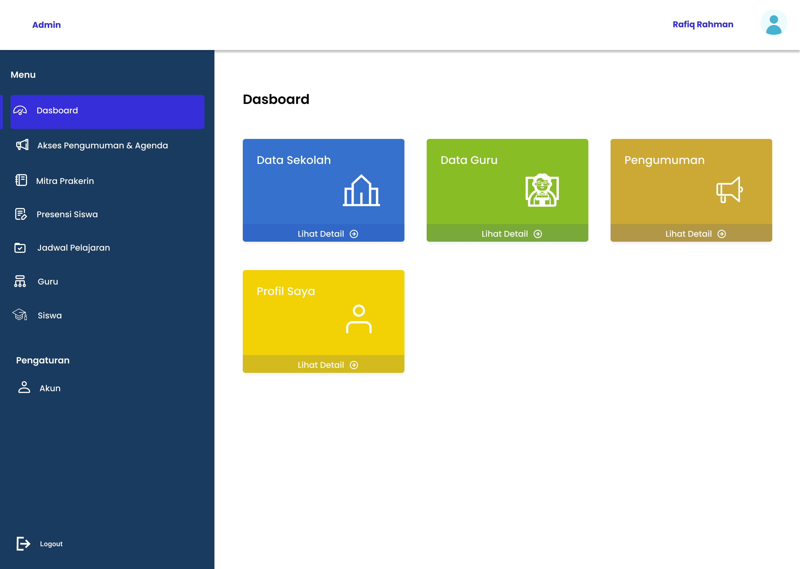
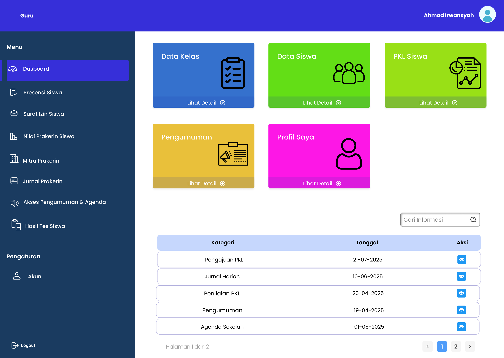
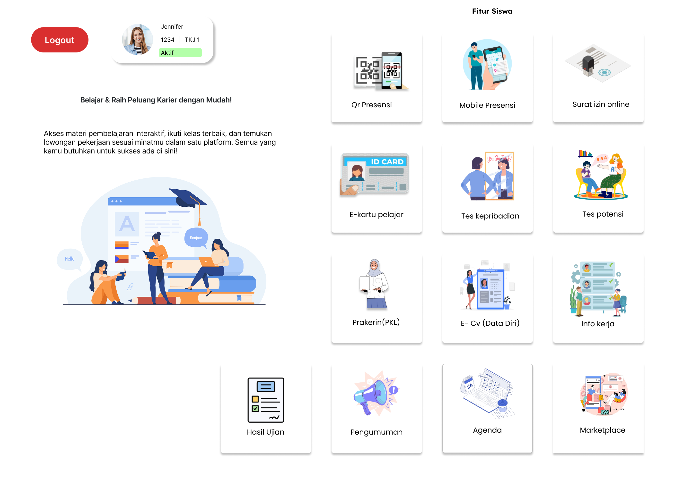

# 🎓 E-Portal Sekolah

<p align="center">
  
</p>

<p align="center">
  <b>Modern School Management Portal UI/UX Design</b><br>
  Menghubungkan Siswa, Guru, dan Admin dalam satu platform digital yang modern.
</p>

<p align="center">
  <a href="https://www.figma.com/design/anxHez2cB4nGAV0CaPMYfX/E-Portal-Sekolah">
    
  </a>
</p>

---

## ✨ Overview

E-Portal Sekolah adalah desain UI/UX berbasis Figma yang dirancang untuk meningkatkan pengalaman pengguna dalam mengakses informasi akademik, komunikasi sekolah, dan manajemen data pendidikan.

### 🎯 Goals

* Mempermudah akses informasi akademik
* Meningkatkan komunikasi antar pengguna
* Menyediakan pengalaman yang modern & responsif
* Mendukung aksesibilitas pengguna

---

## 🛠 Design Stack

<p align="center">
  
</p>

---

## 📊 Project Information

| Item             | Detail               |
| ---------------- | -------------------- |
| 🎨 Design Tool   | Figma                |
| 📱 Platform      | Mobile & Desktop     |
| 👥 User Role     | Admin, Guru, Siswa   |
| 📐 Design System | 8px Grid             |
| ♿ Accessibility  | User-Centered Design |
| 📅 Status        | Completed            |

---

## 🚀 Main Features

### 👨‍🎓 Student Portal

* Dashboard Akademik
* Nilai & Rapor
* Pengumuman Sekolah
* Informasi Magang
* Profil Siswa

### 👨‍🏫 Teacher Portal

* Dashboard Guru
* Input Nilai
* Jurnal Mengajar
* Pengumuman Kelas

### 👨‍💼 Admin Portal

* Manajemen Kelas
* Manajemen Mata Pelajaran
* Kelola Pengguna
* Publikasi Pengumuman

---

## 🎨 Design System

<details>
<summary><b>Click to Expand</b></summary>

### Typography

* Poppins
* Inter

### Color Palette

| Color     | Hex     |
| --------- | ------- |
| Primary   | #4F46E5 |
| Secondary | #06B6D4 |
| Success   | #10B981 |
| Warning   | #F59E0B |
| Danger    | #EF4444 |

### Components

* Sidebar Navigation
* Header
* Cards
* Buttons
* Modal
* Form Elements
* Notification Panel

</details>

---

## 📸 Preview

### Admin Dashboard



### Teacher Dashboard



### Student Dashboard



---

## 🔄 User Flow

```text
Siswa
Login
   ↓
Dashboard
   ↓
Pengumuman
   ↓
Detail Informasi

Guru
Login
   ↓
Dashboard
   ↓
Input Nilai
   ↓
Publikasi

Admin
Login
   ↓
Kelola Data
   ↓
Publikasi Pengumuman
```

---

## 🔗 Quick Access

### 🎨 Figma Design

https://www.figma.com/design/anxHez2cB4nGAV0CaPMYfX/E-Portal-Sekolah

---

## 👨‍💻 Author

**Mil**

UI/UX Designer • Information Systems Graduate

---

<p align="center">
  ⭐ If you like this project, give it a star!
</p>

<p align="center">
  
</p>
