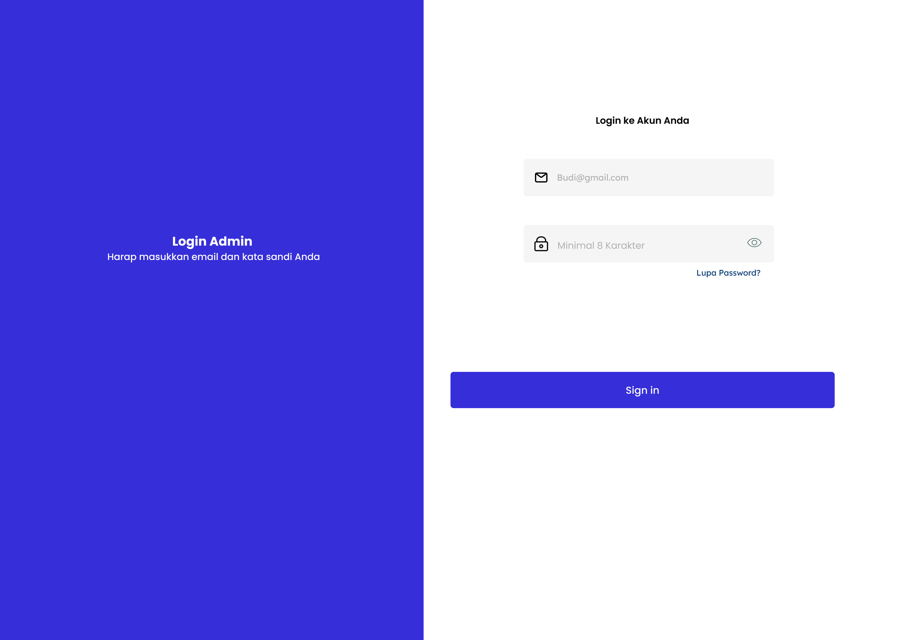
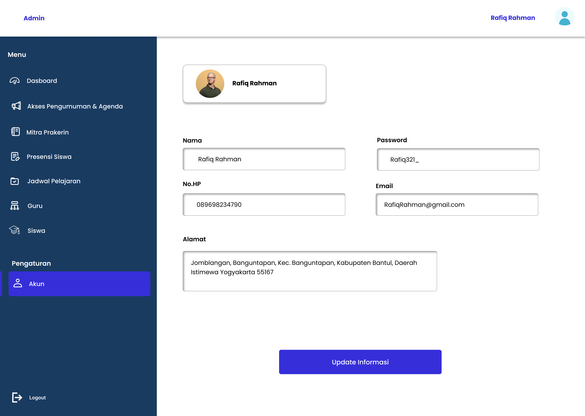
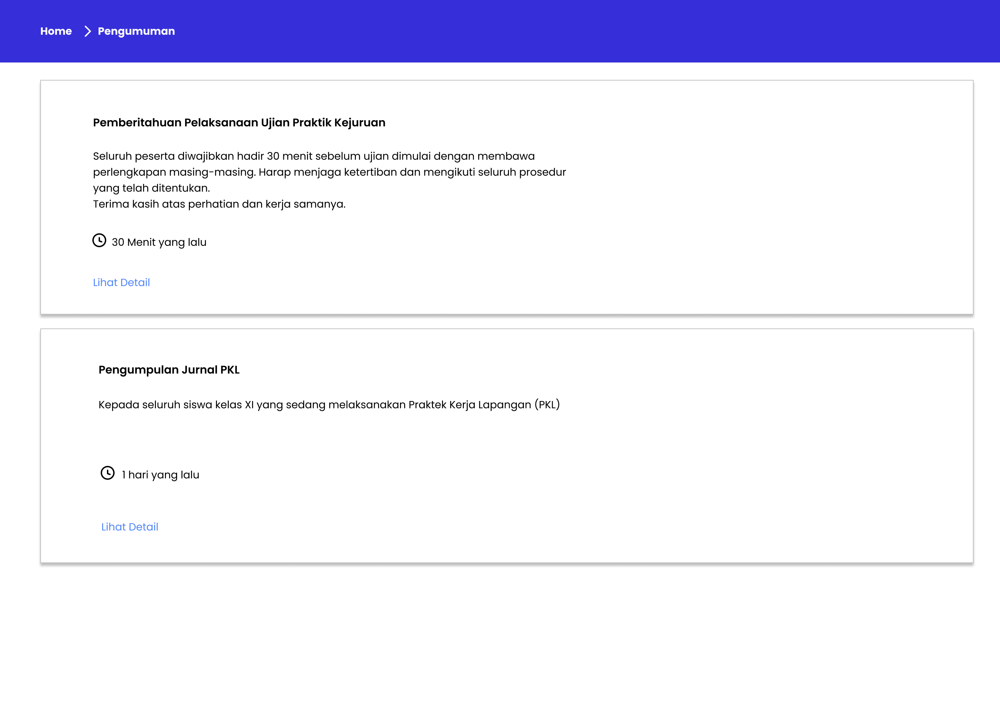
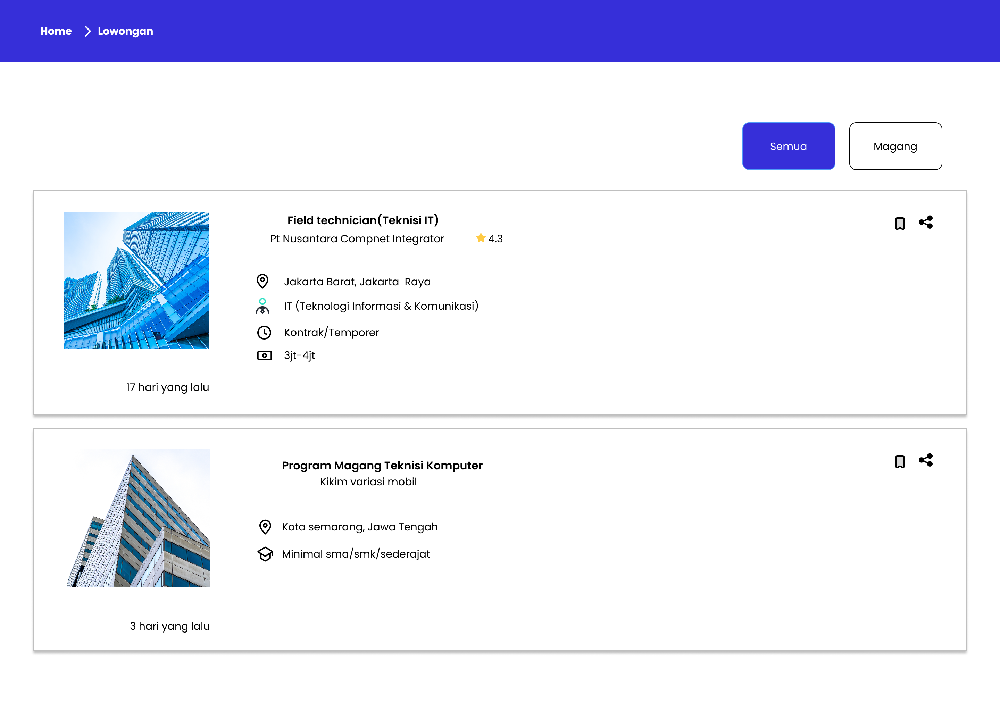

# E-Portal Sekolah — UI/UX Design (Figma)

Desain UI/UX modern & ramah pendidikan — portal yang menyatukan siswa, guru, dan admin.

[](https://www.figma.com/design/anxHez2cB4nGAV0CaPMYfX/E-Portal-Sekolah?node-id=0-1&t=cv7qKhcr4SgOTqU7-1) [](#)

Ringkasan singkat: akses cepat ke nilai, absensi, pengumuman, dan komunikasi antar pengguna dengan desain yang fokus pada keterbacaan dan kemudahan penggunaan.

__Highlight__
- Tujuan: menyederhanakan akses informasi akademik dan komunikasi.
- Platform: Desktop & Mobile (responsive).
- Pendekatan: user-centered + aksesibilitas.

__Quick Links__
- Figma file: https://www.figma.com/design/anxHez2cB4nGAV0CaPMYfX/E-Portal-Sekolah?node-id=0-1&t=cv7qKhcr4SgOTqU7-1
- Screenshots: lihat folder `assets/screenshots/` (admin / guru / siswa)

## Daftar Isi
- [Demo & Preview](#demo--preview)
- [Fitur Utama](#fitur-utama)
- [Komponen & Sistem Desain](#komponen--sistem-desain)
- [User Flows (Singkat)](#user-flows-singkat)
- [Cara Export / Handoff](#cara-export--handoff)
- [Gallery (Screenshots)](#gallery-screenshots)
- [Catatan Teknis & Tips Efek](#catatan-teknis--tips-efek)
- [Contributing & Contact](#contributing--contact)

---

## Demo & Preview

Jika ingin efek interaktif saat scroll: GitHub README tidak mendukung custom CSS/JS. Alternatif yang menarik:

- Gunakan animated GIF atau SVG (bisa terlihat seperti efek saat scroll).
- Gunakan GitHub Pages (static site) untuk efek scroll penuh (parallax, reveal, dll.).

Contoh demo (placeholder gambar — ganti dengan GIF jika ada):


---

## Fitur Utama
- Dashboard personal (ringkasan tugas, pengumuman, jadwal)
- Modul Akademik (nilai, absensi, materi)
- Notifikasi & Pesan antar pengguna
- Profil & Pengaturan

<details>
<summary><strong>Komponen & Sistem Desain</strong></summary>

- Grid & Layout: 8px baseline grid, breakpoint mobile/tablet/desktop
- Warna & Tipografi: palet ramah pendidikan, fokus keterbacaan
- Komponen: header, sidebar responsif, kartu info, tombol aksi, form, modal

</details>

## User Flows (Singkat)
- Siswa: Login → Dashboard → Lihat Pengumuman → Detail → Simpan/Tindak Lanjut
- Guru: Login → Dashboard → Input Nilai → Lihat Jurnal → Kirim Pengumuman
- Admin: Login → Kelola Kelas/Mapel → Publikasi Pengumuman

---

## Cara Export / Handoff
1. Buka file Figma (link di atas).
2. Pilih frame / screen untuk export.
3. Inspect panel → salin gaya / spacing / ukuran.
4. Export: PNG @2x untuk screenshot, SVG untuk ikon.

Jika ingin otomatis: gunakan `figma_export.py` di repo untuk mengekspor semua frame ke `assets/screenshots/`.

```powershell
$env:FIGMA_TOKEN='YOUR_FIGMA_TOKEN'
python figma_export.py --file-key anxHez2cB4nGAV0CaPMYfX
```

---

## Gallery (Screenshots)
Berikut beberapa tampilan utama (klik untuk melihat ukuran penuh):

### Admin
- Dashboard: 
- Login: 
- Profil: 

### Guru
- Dashboard: 
- Lihat Pengumuman: 
- Nilai Siswa: 

### Siswa
- Dashboard Aktif: 
- Pengumuman: 
- Lowongan/Magang: 

_Catatan_: beberapa file memiliki spasi: jika gambar tidak muncul, bisa rename ke format tanpa spasi.

---

## Catatan Teknis & Tips Efek
- GitHub README tidak mendukung custom JS/CSS — gunakan GIF/SVG untuk meniru efek.
- Untuk pengalaman penuh (scroll animations, parallax), deploy halaman statis (GitHub Pages / Netlify) menggunakan HTML/CSS/JS.

Contoh pendekatan ringan:

- Buat short animated GIF (reveal on scroll) dari prototype Figma.
- Sisipkan GIF di README untuk impresi dinamis.

---

## Contributing & Contact
- Ingin lebih banyak gambar, penjabaran UX, atau versi bahasa Inggris? Saya bantu.
- Pembuat desain: (Isi nama Anda di sini)
- Email: (Isi email Anda di sini)

Jika ingin saya tambahkan seluruh gallery (semua file) ke README atau buat versi halaman GitHub Pages, jawab yes dan saya akan bantu susun.

